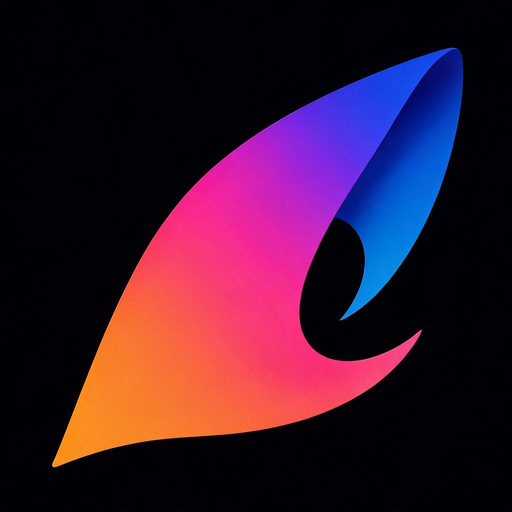

# Icon Design

结合产品与名称，探索原创图标；先比较轮廓、留白和色彩，再交给 Apple Icon Composer 完成材质与平台适配。名称关联可以很轻，不必画成字母或实物。

包含一个 Codex 插件和两个可选脚本，不需要 npm 包、MCP 或常驻服务。插件负责创意方向、生成调用、小尺寸评审和交付；Icon Composer 负责原生 `.icon` 文档。生图优先使用 imagegen 技能和可用的内置工具。内置工具不可用时，会先询问图片 API 地址和是否启用 Imagegen 命令行路线；也可以选择已授权的 OpenRouter。第三方服务调用前确认实际地址与费用。不会自动发布或替换用户尚未确认的图标。

- `plugins/icon-design/skills/icon-design/SKILL.md`：插件入口。
- `scripts/openrouter-image.mjs`：技能目录内的可选图片生成适配器，Node.js 22+，密钥通过环境变量注入。
- `scripts/icon-assets.py`：技能目录内的透明素材整理及 ICNS 打包，Python + Pillow；ICNS 需要 macOS。

MiniBridge 已采用 B2：将选中的栅格轮廓重建为两个独立 SVG 图层，完成 Icon Composer 原生 Default/Dark 导出和 ICNS 集成。MiniDock 采用 N2 Little Lookout；经过眼睛与耳朵的整体姿态修正，已生成原生 Default 预览并集成本地 App。MiniDock 使用整张栅格图层与手动 Dock 留白，不声称具备独立矢量图层或完整 Dark 适配。

品牌：ailuntz · https://www.ailuntz.com。本地插件版本：0.2.1。使用说明与脚本包含在插件内，无需 npm 安装。

此版本沿用 Color Sail 图标；内置生图工具不可用时，会发现本机 Codex Profiles 中的候选图片接口，供用户选择并授权 Imagegen 命令行路线。[在插件目录安装 Icon Design](https://chatgpt.com/plugins/plugins_6ab4afd6b1188191a10f9cd382d2f196) · [下载 0.2.2 发布包](https://github.com/ailuntx/icon-design/releases/tag/v0.2.2)。旧版 AI Icon Studio 已从公开目录下架。

[Privacy](docs/privacy.md) · [Terms](docs/terms.md)

开发验证：`node --test tests/generation.test.mjs`，以及在安装 Pillow 的 Python 环境中运行 `python -m unittest discover -s tests -p 'test_*.py'`。
